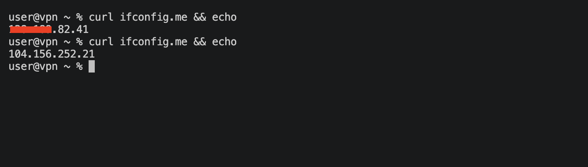

# 0xVPN

A simple self-hosted VPN over UDP with AES-256-GCM encryption.

---

## Server setup (Linux VPS)

First SSH into your VPS:

```bash
ssh root@YOUR_VPS_IP
```

Then run the installer:

```bash
curl -fsSL https://raw.githubusercontent.com/H6NG/0xVPN/main/setup/install-linux.sh | bash
```

Get your shared key (you'll need it on the client):

```bash
grep shared_key /opt/0xvpn/configs/server.toml
```

Then start the server:

```bash
cd /opt/0xvpn
./venv/bin/python3 setup/cli.py start --config configs/server.toml
```

> **If you get "Device or resource busy" or "Address already in use"**, kill the old process first:
> ```bash
> pkill -f "cli.py start"
> ip link delete tun0
> ```
> Then start the server again.

---

## Client setup

### macOS & Linux

```bash
bash <(curl -fsSL https://raw.githubusercontent.com/H6NG/0xVPN/main/setup/install-macos.sh)
```

Then connect:

```bash
0xvpn connect
```

It will ask for your VPS IP, port, and shared key on first run.

### Windows

Run as Administrator in PowerShell:

```powershell
git clone https://github.com/H6NG/0xVPN.git
cd 0xVPN\setup
python -m venv venv
.\venv\Scripts\pip install -r requirements.txt
python cli.py connect
```

> **Note:** Windows requires the [Wintun driver](https://www.wintun.net) and `pip install wintun`.

---

## Commands

```bash
0xvpn connect      # connect
0xvpn disconnect   # disconnect
0xvpn status       # check status
```

---

## Check your current IP address

```bash
curl ifconfig.me
```

---

## Notes

- Requires sudo/admin (TUN interface needs root)
- DNS is set automatically on connect and restored on disconnect
- Hit Ctrl+C to disconnect

---

## Before / After Image



